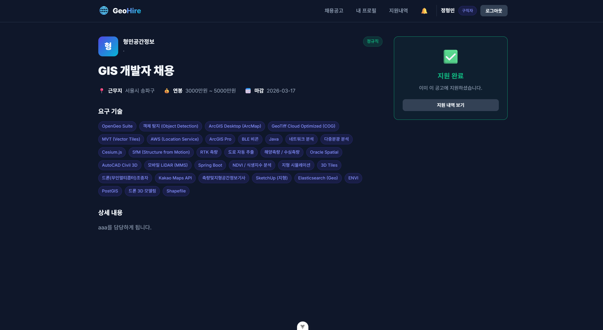
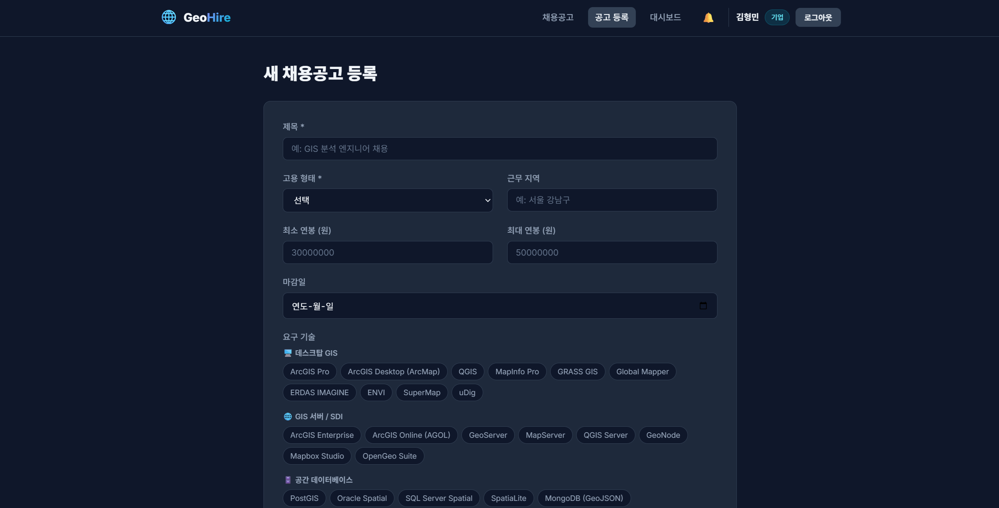
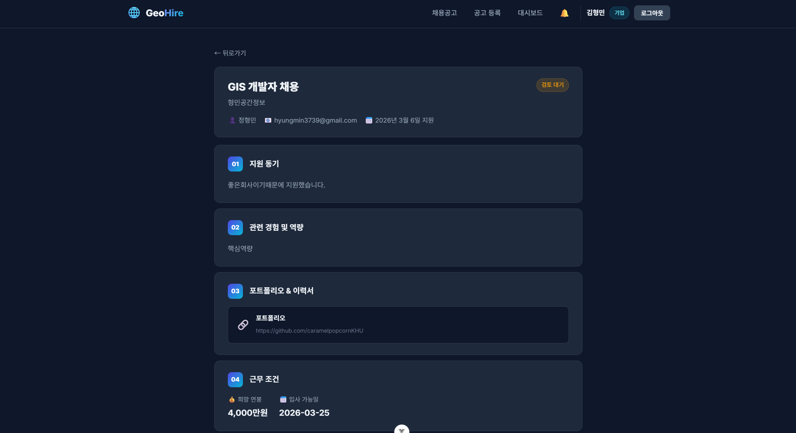
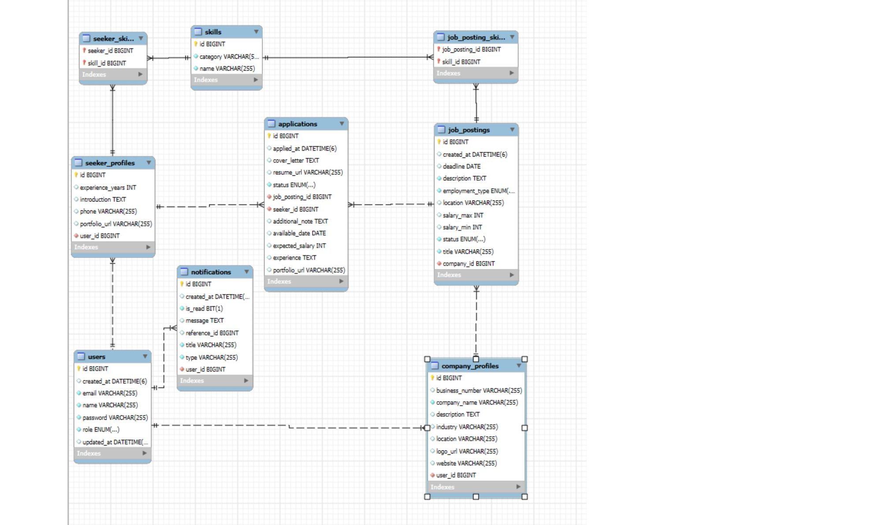

# GeoHire — 공간정보 채용 플랫폼

공간정보(GIS, 측량, 원격탐사, 드론 등) 분야에 특화된 채용 플랫폼입니다.

## 기술 스택

| 구분         | 기술                                                   |
| ------------ | ------------------------------------------------------ |
| **Backend**  | Spring Boot 3.4, Spring Data JPA, Spring Security, JWT |
| **Frontend** | Vue 3, Vite, Vue Router, Pinia, Axios                  |
| **Database** | MySQL 8.x                                              |

## 주요 기능

- 🔐 **회원가입 / 로그인** — 구직자·기업 역할 분리, JWT 인증
- 📋 **채용공고 관리** — CRUD, 검색·필터링(키워드/지역/고용형태/기술스택)
- 🛠️ **150+ 공간정보 스킬** — 19개 카테고리 (데스크탑 GIS, Web GIS, 원격탐사, LiDAR, GeoAI 등)
- 📝 **상세 지원서** — 지원동기, 경험, 포트폴리오, 희망연봉, 입사가능일
- 👥 **지원자 관리** — 기업 대시보드에서 지원서 열람 및 상태 변경
- 🔔 **알림 시스템** — 지원 접수·상태 변경 시 자동 알림, 미읽음 뱃지
- 👤 **프로필 관리** — 구직자 이력서·기술스택 관리

## 스크린샷

### 🏠 메인 페이지


### 🔍 채용공고 검색


### 📄 채용공고 상세



### 📝 새 채용공고 등록



### 📋 지원서 상세



### 🗄️ ERD (데이터베이스 구조)



## 프로젝트 구조

```
hiring/
├── backend/          # Spring Boot
│   └── src/main/java/com/geohire/
│       ├── config/       # Security, JWT, DataInitializer
│       ├── controller/   # REST API
│       ├── dto/          # Request/Response DTOs
│       ├── entity/       # JPA Entities
│       ├── repository/   # Spring Data Repositories
│       ├── service/      # Business Logic
│       └── exception/    # Global Exception Handler
└── frontend/         # Vue 3 + Vite
    └── src/
        ├── api/          # Axios 인스턴스
        ├── components/   # Navbar
        ├── composables/  # 공유 로직
        ├── stores/       # Pinia (Auth)
        ├── router/       # Vue Router
        └── views/        # 12개 페이지
```

## 실행 방법

### 사전 요구사항

- Java 17+
- Node.js 18+
- MySQL 8.x

### 1. 데이터베이스 생성

```sql
CREATE DATABASE geohire CHARACTER SET utf8mb4 COLLATE utf8mb4_unicode_ci;
```

### 2. Backend

```bash
cd backend
# application.properties에서 DB 비밀번호 확인
.\gradlew.bat bootRun     # Windows
./gradlew bootRun          # Mac/Linux
```

> 첫 실행 시 테이블 자동 생성 + 150개 공간정보 스킬 시드 데이터 입력

### 3. Frontend

```bash
cd frontend
npm install
npm run dev
```

> http://localhost:5173 에서 접속 (Backend: http://localhost:8080)

## API 요약

| Method  | Endpoint                      | 설명             |
| ------- | ----------------------------- | ---------------- |
| POST    | `/api/auth/signup`            | 회원가입         |
| POST    | `/api/auth/login`             | 로그인           |
| GET     | `/api/jobs`                   | 공고 검색        |
| POST    | `/api/jobs`                   | 공고 등록 (기업) |
| GET     | `/api/jobs/{id}`              | 공고 상세        |
| POST    | `/api/applications/jobs/{id}` | 지원             |
| GET     | `/api/applications/{id}`      | 지원서 상세      |
| GET/PUT | `/api/profile/seeker`         | 구직자 프로필    |
| GET     | `/api/notifications`          | 알림 목록        |
| GET     | `/api/skills`                 | 스킬 목록        |

## 라이선스

MIT License
